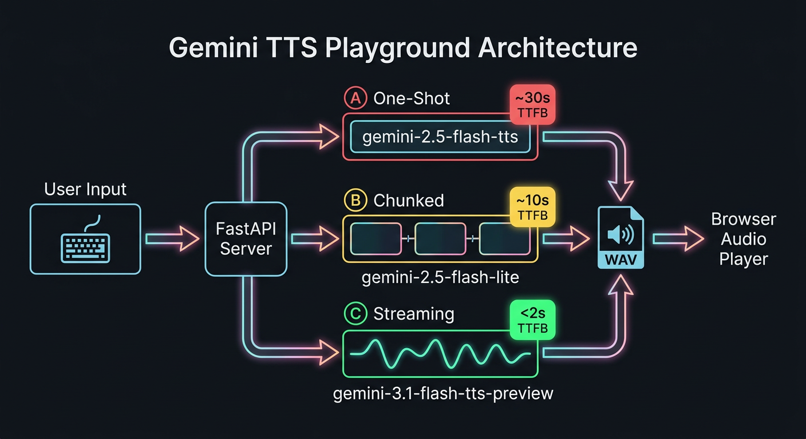
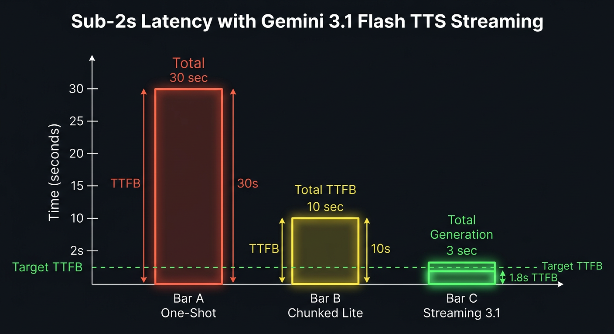
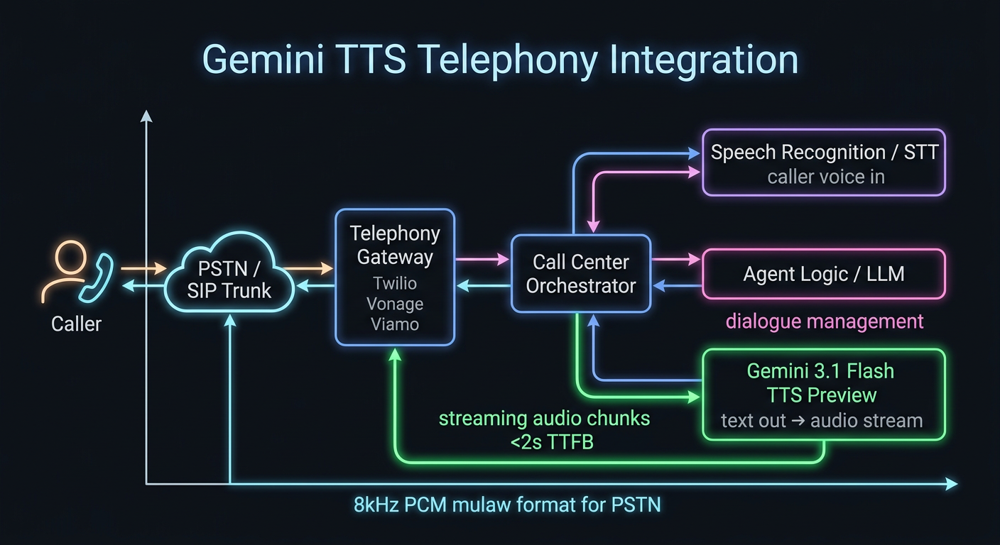
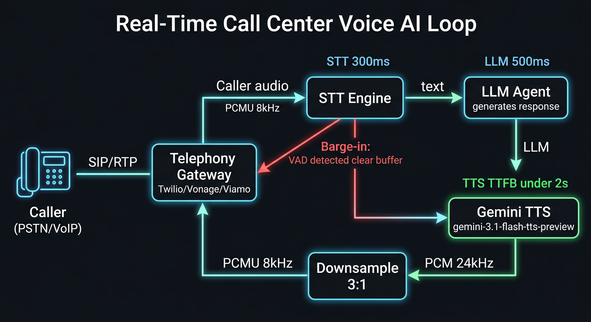

# 🎙 Gemini TTS Playground

A web application for benchmarking **Google Gemini Text-to-Speech** models with real-time latency metrics. Built to solve a specific challenge: achieving **sub-2-second Time-to-First-Audio (TTFB)** for telephony and call center applications.

---

## Architecture



Three TTS approaches are benchmarked side-by-side, all accessible from the same UI:

| Option | Model | Approach | TTFB |
|--------|-------|----------|------|
| **A** | `gemini-2.5-flash-tts` | One-shot — full audio before return | ~30s |
| **B** | `gemini-2.5-flash-lite-preview-tts` | Chunked — split text → sequential calls → stitch | ~10s |
| **C ⭐** | `gemini-3.1-flash-tts-preview` | True streaming — chunks arrive as generated | **< 2s** |

## Latency Benchmarks



Option C (streaming) achieves sub-2s TTFB on the **full 1-minute Viamo agent script** — the downstream system can begin playback before generation is complete.

---

## Features

- **3 model options** with live metric comparison
- **Real-time metrics**: TTFB, Total Generation Time, Audio Duration, Real-time Factor, Chunks, File Size
- **System Instruction / Style Prompt** — guide tone, emotion and speaking style
- **5 preset styles**: Professional, Warm & Friendly, Energetic, Whisper, News Anchor
- **13 voices**: Aoede, Charon, Fenrir, Kore, Puck, Orus, Zephyr, Leda, Sulafat, Iapetus, Umbriel, Algenib, Rasalgethi
- **Telephony Mode** — one-click 8kHz downsampling (PCMU) for call center compatibility
- **In-browser audio playback** — no downloads needed
- **Run history** — last 8 generations with metrics, click to replay
- **Sample prompts** — short / medium / long / markup tags

---

## Quick Start

### Run Locally

```bash
git clone git@github.com:analyticsrepo01/gemini_tts.git
cd gemini_tts
pip install -r requirements.txt

# Option 1: Vertex AI (on GCP with ADC configured)
python serve.py

# Option 2: AI Studio API key
GEMINI_API_KEY=your_key python serve.py
```

Open: [http://localhost:7779](http://localhost:7779)

### Deploy to Cloud Run

```bash
gcloud run deploy gemini-tts \
  --source . \
  --region us-central1 \
  --allow-unauthenticated \
  --set-env-vars "GEMINI_API_KEY=your_key,AUDIO_DIR=/tmp/audio_output" \
  --memory 1Gi --cpu 1 --timeout 300 \
  --project your-project-id
```

---

## API

### `POST /generate`

```json
{
  "text": "Thank you for calling Viamo support.",
  "model": "C",
  "voice": "Aoede",
  "instruction": "Speak warmly and with genuine empathy.",
  "telephony": true
}
```

**Response:**
```json
{
  "filename": "tts_abc123.wav",
  "metrics": {
    "ttfb": 1.86,
    "total_time": 3.21,
    "audio_duration": 4.5,
    "chunks": 97,
    "rtf": 1.4,
    "size_kb": 70.3,
    "sample_rate": "8kHz",
    "model": "gemini-3.1-flash-tts-preview",
    "approach": "Streaming ⭐"
  }
}
```

Audio served at: `GET /audio/{filename}`

---

## Telephony Integration



Gemini 3.1 Flash TTS slots into a standard telephony stack as the TTS engine:

1. **Caller** speaks → STT transcribes → Agent LLM generates response text
2. Text sent to **Gemini 3.1 Flash TTS** via `generate_content_stream`
3. First audio chunk arrives in **< 2s** → streamed immediately to the gateway
4. Audio delivered in **8kHz PCM mulaw** (PSTN standard) — enable Telephony Mode in the app or set `"telephony": true` in the API

```python
# Minimal streaming integration example
for chunk in client.models.generate_content_stream(
    model="gemini-3.1-flash-tts-preview",
    contents=agent_response_text,
    config=GenerateContentConfig(speech_config=...),
):
    pcm = chunk.candidates[0].content.parts[0].inline_data.data
    if pcm:
        telephony_gateway.send_audio(downsample_to_8k(pcm))  # stream to caller
```

Compatible gateways: **Twilio Media Streams**, **Vonage WebSockets**, **Viamo**, any SIP/RTP stack accepting PCM.

---

## Markup Tags (Model C only)

Gemini 3.1 Flash TTS supports expressive inline tags:

```
[sigh] I understand your frustration. [short pause]
Let me look into this [whispering] right away.
[medium pause] Great news — [energetic] we got it sorted!
```

Supported: `[sigh]` `[laughing]` `[uhm]` `[sarcasm]` `[robotic]` `[shouting]` `[whispering]` `[extremely fast]` `[short pause]` `[medium pause]` `[long pause]`

---

## Files

```
gemini_tts/
├── serve.py          # FastAPI backend — TTS generation, 8kHz downsampling, audio serving
├── index.html        # Single-page web UI — metrics, voice picker, system instruction
├── gemini_tts.ipynb  # Benchmark notebook — all 4 options with full metrics
├── test_tts.py       # Smoke test — validates all 3 models
├── Dockerfile        # Cloud Run deployment
├── requirements.txt
├── images/           # Architecture and benchmark diagrams
└── audio_output/     # Sample generated WAV files
```

---

## Background

Built as part of a latency investigation for a telephony TTS pipeline. The key finding: **`gemini-3.1-flash-tts-preview` with streaming (`generate_content_stream`) achieves <2s TTFB** on long-form text, making it viable for real-time call center use without the structural complexity of the Live API.

See `gemini_tts.ipynb` for the full benchmark including Cloud TTS `streaming_synthesize` (Option D).

---

## Best Practices: TTS + Telephony Integration

### Real-Time Call Loop



The full voice AI loop: Caller → Gateway → STT → LLM → TTS → Gateway → Caller. Barge-in (VAD detection) clears the TTS buffer and interrupts playback immediately.

---

### 1. Audio Format

| Network | Codec | Sample Rate | Bytes / 20ms packet |
|---------|-------|-------------|---------------------|
| PSTN / Twilio | G.711 PCMU (µ-law) | 8 kHz | 160 bytes |
| PSTN / ISDN | G.711 PCMA (A-law) | 8 kHz | 160 bytes |
| HD Voice (VoLTE) | G.722 | 16 kHz | 320 bytes |
| Vonage WebSocket | L16 PCM | 8 / 16 / 24 kHz | configurable |

**Gemini TTS outputs 24kHz PCM16** — always downsample before sending to a PSTN gateway:

```python
import array

def downsample_8k(pcm24: bytes) -> bytes:
    """3:1 decimation: 24kHz → 8kHz PCM16."""
    samples = array.array('h', pcm24)
    return array.array('h', samples[::3]).tobytes()

def encode_mulaw(pcm16: bytes) -> bytes:
    """Convert PCM16 → G.711 µ-law (required by Twilio Media Streams)."""
    import audioop
    return audioop.lin2ulaw(pcm16, 2)
```

**Twilio-specific**: payload must be base64-encoded raw mulaw with **no WAV file header**.

```python
import base64

def to_twilio_media(pcm24: bytes) -> dict:
    pcm8 = downsample_8k(pcm24)
    ulaw = encode_mulaw(pcm8)
    return {
        "event": "media",
        "streamSid": stream_sid,
        "media": {"payload": base64.b64encode(ulaw).decode()}
    }
```

---

### 2. Latency Targets

| Stage | Target | Notes |
|-------|--------|-------|
| STT (speech-to-text) | < 300 ms | Cloud STT streaming, end-of-utterance detection |
| LLM (response gen) | < 500 ms | Start streaming to TTS as tokens arrive |
| TTS TTFB | **< 2 s** | First audio chunk to gateway |
| Total turn latency | **< 3 s** | Caller perception threshold for natural conversation |

> **Key insight**: pipeline the stages — don't wait for LLM to finish before starting TTS. Stream LLM tokens into TTS as they arrive for minimum end-to-end latency.

---

### 3. Streaming vs. One-Shot

| Approach | TTFB | When to use |
|----------|------|-------------|
| One-shot (`generate_content`) | 10–30 s | Async voicemail, non-real-time |
| Chunked (split text → sequential calls) | 5–15 s | Fallback when streaming unavailable |
| **Streaming** (`generate_content_stream`) | **< 2 s** | All real-time telephony |

Always use streaming for live calls. The caller hears audio before generation is complete.

---

### 4. Text Chunking (for non-streaming fallback)

```python
import re

def split_sentences(text: str, max_words: int = 40) -> list[str]:
    """Split at sentence boundaries, respecting API 4KB limit."""
    sentences = re.split(r'(?<=[.!?])\s+', text.strip())
    chunks, current, wc = [], [], 0
    for s in sentences:
        w = len(s.split())
        if wc + w > max_words and current:
            chunks.append(" ".join(current))
            current, wc = [s], w
        else:
            current.append(s)
            wc += w
    if current:
        chunks.append(" ".join(current))
    return chunks or [text]
```

- Split at **sentence boundaries** (`[.!?]`), not words — cuts mid-word produce audible glitches
- Apply style instruction to **first chunk only** to avoid repetition artifacts
- Gemini TTS limit: **4,000 bytes** per text field, **8,000 bytes** combined with prompt

---

### 5. Barge-In (Caller Interrupts TTS)

Barge-in is the most critical UX feature. When the STT engine detects speech, immediately clear the audio buffer:

**Twilio:**
```python
ws.send(json.dumps({"event": "clear", "streamSid": stream_sid}))
```

**Vonage:**
```python
ws.send(json.dumps({"event": "clear"}))
```

Architecture pattern:
1. STT runs in parallel with TTS playback
2. On `speech_start` or `activity_start` event → send `clear` to gateway
3. Cancel any in-flight TTS streaming generator
4. Hand control back to STT to collect the full utterance

```python
import asyncio

async def handle_barge_in(gateway_ws, tts_task: asyncio.Task):
    # Called when VAD detects caller speaking
    tts_task.cancel()
    await gateway_ws.send_json({"event": "clear", "streamSid": stream_sid})
```

---

### 6. Style Control & Markup Tags

TTS models **do not support `system_instruction`** in the config — prepend style guidance to the content:

```python
def apply_instruction(text: str, instruction: str) -> str:
    if not instruction.strip():
        return text
    return f"{instruction.strip()}\n\nNow say the following:\n{text}"
```

For maximum predictability, keep **style prompt + text content + markup tags semantically consistent**.

**Supported markup (Model C / `gemini-3.1-flash-tts-preview` only):**

```
[sigh] I understand your frustration. [short pause]
Let me look into that [whispering] right away.
[medium pause] Great news — [energetic] we got it sorted!
```

| Category | Tags |
|----------|------|
| Non-speech sounds | `[sigh]` `[laughing]` `[uhm]` |
| Style | `[sarcasm]` `[robotic]` `[shouting]` `[whispering]` `[extremely fast]` |
| Pacing | `[short pause]` `[medium pause]` `[long pause]` |

---

### 7. RTP Packetization & Jitter Buffers

For direct SIP/RTP integration (bypassing WebSocket gateways):

- **Packet size**: 20ms standard (160 bytes mulaw at 8kHz)
- **Packetization**: split the PCM stream into 160-byte (mulaw) or 320-byte (L16 8kHz) chunks
- **Jitter buffer**: add 20–60ms at the receiving end to absorb network jitter
- **Timestamp**: increment RTP timestamp by 160 per packet (at 8kHz)
- **SSRC**: keep constant for a single TTS stream

```python
def packetize_mulaw(ulaw: bytes, packet_ms: int = 20) -> list[bytes]:
    """Split mulaw stream into RTP-sized packets (160 bytes = 20ms at 8kHz)."""
    size = 8 * packet_ms  # 8 samples/ms at 8kHz
    return [ulaw[i:i+size] for i in range(0, len(ulaw), size)]
```

---

### 8. Error Handling & Fallback

```python
async def generate_with_fallback(text: str, voice: str, fallback_voice: str = "Aoede"):
    try:
        return await asyncio.wait_for(
            generate_tts(text, voice),
            timeout=5.0  # abort if first chunk takes > 5s
        )
    except asyncio.TimeoutError:
        # Log and retry with fallback voice
        return await generate_tts(text, fallback_voice)
    except Exception as e:
        # Final fallback: pre-recorded error message
        return load_static_audio("error_please_hold.wav")
```

- Set a **5s hard timeout** on TTFB — if first chunk doesn't arrive, fall back
- Keep a library of **pre-recorded fallback phrases** for error states
- **Retry once** on transient API errors before falling back
- Log TTFB per call to detect model degradation

---

### 9. Gemini TTS Model Selection

| Model | TTFB | Cost | Best for |
|-------|------|------|----------|
| `gemini-3.1-flash-tts-preview` | **< 2s** | Low | Real-time telephony ⭐ |
| `gemini-2.5-flash-tts` | ~10–30s | Low | Async, voicemail |
| `gemini-2.5-flash-lite-preview-tts` | ~5–15s (chunked) | Lowest | Cost-sensitive, non-RT |
| `gemini-2.5-pro-tts` | ~30s+ | High | Audiobooks, podcasts |

**API selection:**
- **Vertex AI** (`generate_content_stream`) — unified with Gemini, temperature control, streaming PCM 24kHz
- **Cloud TTS** (`streaming_synthesize`) — use if migrating from Chirp 3 HD, supports MULAW/ALAW output directly

---

### 10. Anti-Patterns to Avoid

| Anti-Pattern | Problem | Fix |
|---|---|---|
| Wait for full audio before sending | Adds 10–30s latency | Stream chunks as they arrive |
| Send WAV header in Twilio payload | Garbled audio | Strip header, send raw mulaw bytes |
| Apply style instruction to every chunk | Repetition artifacts | Apply to first chunk only |
| Use `system_instruction` config field | 400 INVALID_ARGUMENT | Prepend to content text instead |
| Chunk at word boundaries | Audible glitches | Always split at sentence boundaries |
| No barge-in implementation | Caller can't interrupt | Clear buffer on VAD speech_start |
| No timeout on TTS TTFB | Hanging calls | 5s timeout, then fallback audio |
| Single retry on network error | Silent failures | Exponential backoff + fallback voice |
